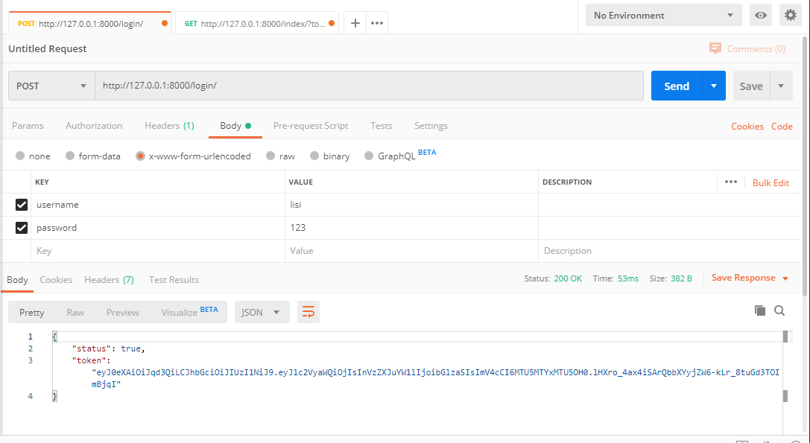
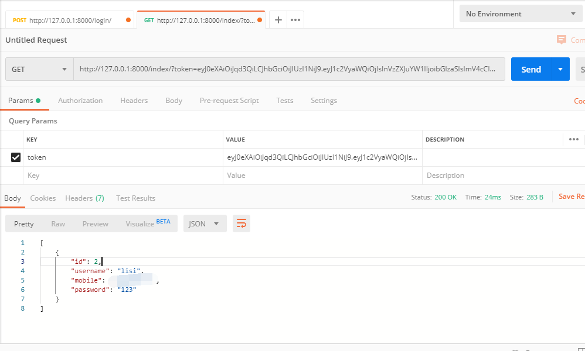

## JWTAuthentication

## 1.基于rest_framework下使用jwt进行认证


```python
# 1. 路由：
# urls.py
from user import views

urlpatterns = [
    url(r'^login/$', views.LoginView.as_view()),
    url(r'^order/$', views.OrderView.as_view()),
]


# views.py

class LoginView(APIView):
    authentication_classes = []  # 设置为空表示该接口不需要认证

    def post(self, request, *args, **kwargs):
        """ 用户登录 """
        user = request.POST.get('username')
        pwd = request.POST.get('password')

        # 检测用户和密码是否正确，此处可以在数据进行校验。
        user = UserInfo.objects.filter(username=user, password=pwd).first()
        if user:
            # 用户名和密码正确，给用户生成token并返回
            token = create_token({'userid': user.id, 'username': user.username})
            return Response({'status': True, 'token': token})
        return Response({'status': False, 'error': '用户名或密码错误'})
    
    
    
class OrderView(APIView):
    # 通过url传递token, #全局已经配置
    # authentication_classes = [JwtQueryParamAuthentication, ]

    # 通过Authorization请求头传递token
    # authentication_classes = [JwtAuthorizationAuthentication, ]

    def get(self, request, *args, **kwargs):
        print(request.user, request.auth)
        return Response({'data': '订单列表'})

    def post(self, request, *args, **kwargs):
        print(request.user, request.auth)
        return Response({'data': '添加订单'})

    def put(self, request, *args, **kwargs):
        print(request.user, request.auth)
        return Response({'data': '修改订单'})

    def delete(self, request, *args, **kwargs):
        print(request.user, request.auth)
        return Response({'data': '删除订单'})    
    
    
# settings    
REST_FRAMEWORK = {

    # 全局认证类
    'DEFAULT_AUTHENTICATION_CLASSES': ['user.utils.auth.JwtQueryParamAuthentication', 'user.utils.auth.JwtAuthorizationAuthentication']
}
```


## 2.登录获取token




## 3.请求需要认证的接口




## 4.jwt优缺点

优点：减少服务器端的存储

JWT在web应用中的缺陷：
缺点一： 无法满足注销场景  

用户访问时就不会携带 jwt，服务端就认为用户需要重新登录。这是一个典型的假注销，对于用户表现出退出的行为，实际上这个时候携带对应的 jwt 依旧可以访问系统 

 借助第三方存储自己管理 jwt 的状态，可以以 jwt 为 key，实现去 redis 一类的缓存中间件中去校验存在性。方案设计并不难，但是引入 redis 之后，就把无状态的 jwt 硬生生变成了有状态了，违背了 jwt 的初衷 


缺点二： 无法满足修改密码场景

 修改密码则略微有些不同，假设号被盗了，修改密码（是用户密码，不是 jwt 的 secret）之后，盗号者在原 jwt 有效期之内依旧可以继续访问系统，所以仅仅清空 cookie 自然是不够的 

缺点二： 无法满足token续签场景
我们知道微信只要你每天使用是不需要重新登录的，因为有token续签，因为传统的 cookie 续签方案一般都是框架自带的，session 有效期 30 分钟，30 分钟内如果有访问，session 有效期被刷新至 30 分钟。但是 jwt 本身的 payload 之中也有一个 exp 过期时间参数，来代表一个 jwt 的时效性，而 jwt 想延期这个 exp 就有点身不由己了，因为 payload 是参与签名的，一旦过期时间被修改，整个 jwt 串就变了，jwt 的特性天然不支持续签

解决：

1.完善 refreshToken
借鉴 oauth2 的设计，返回给客户端一个 refreshToken，允许客户端主动刷新 jwt。一般而言，jwt 的过期时间可以设置为数小时，而 refreshToken 的过期时间设置为数天。我认为该方案并可行性是存在的，但是为了解决 jwt 的续签把整个流程改变了，为什么不考虑下 oauth2 的 password 模式和 client 模式呢？

2.使用 redis 记录独立的过期时间
实际上我的项目中由于历史遗留问题，就是使用 jwt 来做登录和会话管理的，为了解决续签问题，我们在 redis 中单独会每个 jwt 设置了过期时间，每次访问时刷新 jwt 的过期时间，若 jwt 不存在与 redis 中则认为过期。
同样改变了 jwt 的流程

